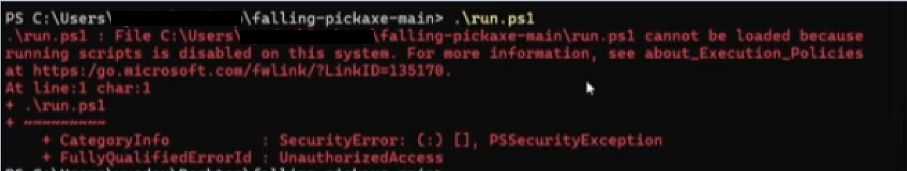
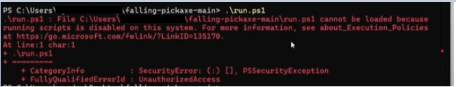

# Falling Pickaxe
Falling Pickaxe Game inspired from YouTube shorts livestreams.

## Before you use it
If you consider streaming this game on your own youtube channel, please add credits in the description of your video/livestream. 

### Quick Start (Recommended)
The easiest way to run the game is using the automated scripts that handle everything for you:

Open PowerShell in the game directory and run:

**For Windows:**
```
./scripts/run.ps1
```

**For Linux/macOS:**
```
chmod +x ./scripts/run.sh
./scripts/run.sh
```

These scripts will automatically:
- Create a Python virtual environment if it doesn't exist
- Install all required dependencies
- Run the game with automatic restart on crashes
- Exit cleanly when you close the game window

### Manual Setup (Advanced Users)
If you prefer to set up the environment manually:

1. Make sure you have Python 3.x installed. If you don't, follow the instructions from the official [python website](http://python.org/downloads/)
2. Create and activate a virtual environment:
   ```
   python -m venv .venv
   # On Windows:
   .venv\Scripts\activate
   # On Linux/macOS:
   source .venv/bin/activate
   ```
3. Install packages:
   ```
   pip install -r requirements.txt
   ```
4. Run the game:
   ```
   python ./src/main.py
   ```

### Configuration (Optional)
1. Make a copy of `default.config.json` to `config.json` or run the game once to automatically copy the config file into `config.json`
2. Create your Google API Key for YouTube.
3. Enable the YouTube Data API v3 for your Google Cloud Project.
4. Enter your credentials in the configuration file.
5. Set your youtube channel id and livestream id in the configuration file.
6. Change configuration to your liking

**Note:** The automated scripts (`run.ps1` and `run.sh`) will run the game and restart it in case of unexpected crashes. When you close the game window normally, the script will exit cleanly. This is perfect for unattended streams.

Steps 2 to 6 are **optional**. You can disable the entire YouTube integration by setting the property: `"CHAT_CONTROL": false`


## Troubleshooting

### 1. PowerShell Script Error (Execution Policy) (Can not run script `./scripts/run.ps1`)

**Symptoms:**
When running `./scripts/run.ps1`, PowerShell shows an error:
`...cannot be loaded. The file is not digitally signed. You cannot run this script on the current system.`

**Cause:**
Windows default security (Execution Policy) is preventing the execution of unsigned scripts.

**Solution:**
Open PowerShell in the game directory and run the following command to allow script execution for your current user:

```powershell
Set-ExecutionPolicy -Scope CurrentUser -ExecutionPolicy Bypass
```

If you see bug like this:  You can run powershell as administrator and run the command again. 

if still not working, try:

```powershell
Set-ExecutionPolicy -Scope CurrentUser -ExecutionPolicy Unrestricted
```


After running this command, you can run `./scripts/run.ps1` normally.

---

### 2. Pygame Installation Error (SSL Certificate / Connection Error)

**Symptoms:**
When the script tries to install dependencies (`pip install -r requirements.txt`), it shows an error like:
`urllib.error.URLError: <urlopen error [SSL: CERTIFICATE_VERIFY_FAILED] certificate verify failed...>`
or `[WinError 10060] A connection attempt failed...` and fails to build `pygame`.

**Cause:**
If you are using experimental Python versions (like Python 3.14), the original `pygame` might not have pre-built wheels. The installation tries to compile from source and download files, which can be blocked by SSL certificates or network timeouts.

**Solution:**
Switch to `pygame-ce` (Pygame Community Edition). It is better optimized and has pre-built wheels for the latest Python versions.

1. Open the `requirements.txt` file in the root directory.
2. Find the line with `pygame==...`.
3. Change it to `pygame-ce==2.5.7`.
4. Save the file and run `./scripts/run.ps1` again.


### Available chat commands
```
tnt

fast
slow

big

wood
stone
iron
gold
diamond
netherite
```

### MegaTNT spawning

Extra details about when a MegaTNT appears in the game:

- New subscribers are detected by periodically polling YouTube for the channel's subscriber count. When an increase is detected the game appends an entry to the `mega_tnt_queue` (the string `"New Subscriber"`) and the MegaTNT will be spawned when the queues are processed.
- Queue processing happens every `QUEUES_POP_INTERVAL_SECONDS` (see `default.config.json` / `config.json`). Polling frequency for YouTube is controlled by `YT_POLL_INTERVAL_SECONDS`.
- Requirements for automatic MegaTNT spawning: `CHAT_CONTROL` must be `true`, a valid `live_chat_id` and `CHANNEL_ID` must be configured so the game can read subscriber counts.
- The queued owner name is currently the literal string `"New Subscriber"` (not the subscriber's username). You can change this behavior in code if you want actual usernames used.
- You can also spawn a MegaTNT manually in-game by pressing the `M` key — this spawns immediately (no queue).
- MegaTNTs use a larger explosion radius, detonate automatically ~4 seconds after spawn, and trigger a stronger camera shake.

**Falling Pickaxe: Ultimate Mining Arcade Game for Streamers – Explosive Action & Massive Earnings!**

Step into the world of **Falling Pickaxe**, the most addictive and interactive mining arcade game designed specifically for YouTube streamers! In this high-energy, physics-based adventure, you control a gigantic pickaxe falling through a dynamic, block-filled landscape. Smash obstacles, trigger explosive TNT, and collect valuable ores to power up your gameplay while engaging with your audience in real time.

**Why Falling Pickaxe is a Must-Play for Streamers:**

- **Interactive Live Chat Integration:** Let your viewers control the game! Live commands and super chats can spawn TNT, upgrade your pickaxe, or trigger wild power-ups, creating a fully immersive, viewer-driven experience that boosts engagement and subscriber growth.
- **Explosive Visuals & Retro Charm:** Enjoy stunning particle effects, realistic physics, and explosive animations that keep your stream exciting and visually captivating. Every impact and explosion is a spectacle that draws in viewers and increases watch time.
- **Monetization & Revenue Opportunities:** Use Falling Pickaxe to maximize your earnings through super chats, donations, and sponsored gameplay challenges. With its fast-paced action and interactive features, your channel becomes a hotspot for gaming enthusiasts and potential sponsors.
- **Community-Driven Challenges:** Host live competitions, subscriber challenges, and donation-triggered events that make every stream a unique and engaging event. Build a loyal community and watch your subscriber count soar!

Transform your YouTube channel into a money-making, interactive gaming hub with **Falling Pickaxe** – the ultimate mining adventure that delivers explosive action, high viewer engagement, and serious revenue potential. Start streaming today and experience the thrill of interactive arcade gaming like never before!

*** build exe
```
.venv\Scripts\pyinstaller.exe --noconfirm --name falling-pickaxe --onefile --windowed --paths src --add-data "src/assets;src/assets" --add-data "default.config.json;." run.py
```


🧨 Các lệnh liên quan đến TNT:
tnt: Thả một khối TNT bình thường xuống với tên của người bình luận.
⚡ Các lệnh liên quan đến Tốc độ & Kích thước:
fast: Tăng tốc độ rơi của đồ vật (Chế độ nhanh).
slow: Giảm tốc độ rơi của đồ vật (Chế độ chậm).
big: Phóng to kích thước của cuốc (Cúp) đang rơi.
⛏️ Các lệnh thả Cuốc (Cúp) theo chất liệu:
wood: Thả cuốc gỗ (Wooden Pickaxe).
stone: Thả cuốc đá (Stone Pickaxe).
iron: Thả cuốc sắt (Iron Pickaxe).
gold: Thả cuốc vàng (Golden Pickaxe).
diamond: Thả cuốc kim cương (Diamond Pickaxe).
netherite: Thả cuốc Netherite (Netherite Pickaxe).
🌟 Ngoài ra còn có các hành động tự động (không cần gõ lệnh):

Tặng Superchat / Supersticker: Game sẽ tự động thả một phần thưởng Superchat TNT siêu lớn.
Đăng ký kênh mới (New Subscriber): Game sẽ tự động kích hoạt một quả Mega TNT.
